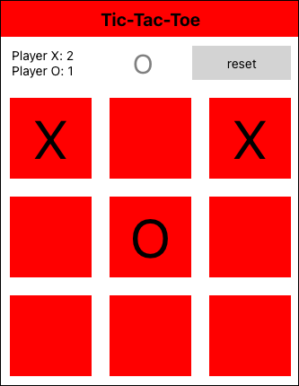

# Aufgabe 1

Ziel der ersten Aufgabe ist es, das aus der Kotlin-Übung bekannte Tic-Tac-Toe-Spiel mit React Native fertig zu schreiben.

Verwendet dabei [snack.expo.dev](https://snack.expo.dev/), um die Aufgabe im Web-Preview zu lösen.
Ihr könnt dafür den Code aus dem Ordner `base` kopieren oder gleich folgenden Link verwenden:

Code: https://snack.expo.dev/yklckGBhQ

Das Ergebnis sollte etwa wie folgt aussehen:

## Aufgabe 1.1

Wie ihr seht, wird in der vorgegebenen Version nur eine Schaltfläche Angezeigt.  
Vervollständigt den Code an der markierten Stelle so, dass eine Matrix von 3x3 Schaltflächen angezeigt wird und das Spiel gespielt werden kann.

*Tipp:*

- Ihr könnt die Elemente des Spielfelds manuell aufbauen oder die `map`-Funktion verwenden.

## Aufgabe 1.2

Vielleicht ist euch aufgefallen, dass der Score oben nicht hochgezählt wird, wenn ein spieler gewinnt.  
Repariert den Programmcode so, dass die Anzeige funktioniert und hochgezählt wird, wenn die entsprechenden Spieler eine Runde gewinnen.

*Tipp:*

- Ihr müsst den Code nur an zwei Stellen anpassen.

## Musterlösung

Die Musterlösung ist in dem Ordner `sample-solution` zu finden oder über folgenden Link aufrufbar:

Lösung mit `map()`: https://snack.expo.dev/ztpwYAdyu
Lösung ohne `map()`: https://snack.expo.dev/IOQoLVtfM
