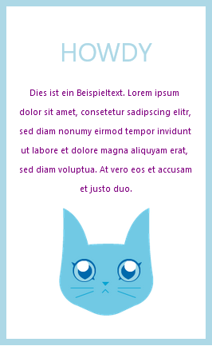
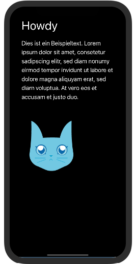

# Aufgabe 2

Füge dem vorgegebenen Code Style-Angaben hinzu, damit das Ergebnis so aussieht wie auf den Screenshots. Nutze plattformspezifische Styles, um das Design zwischen Web und Android ODER iOS zu unterscheiden.

Falls noch Zeit übrigbleibt, teste weitere Style-Anpassungen.

Code: https://snack.expo.dev/k7JYupKcc

Web-Ansicht 

iOS ODER Android Ansicht 

